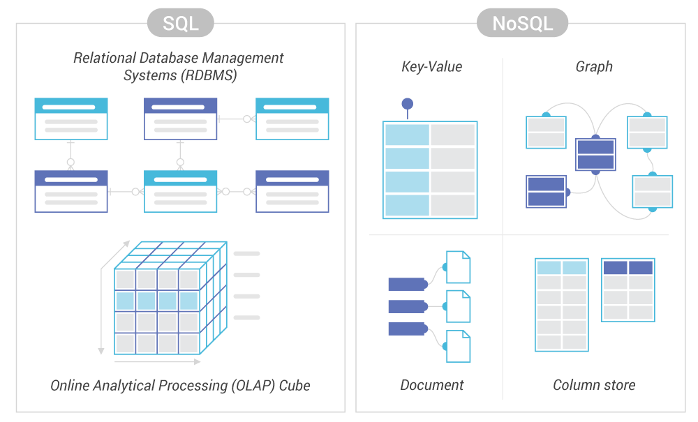

# 37_nosql_mongodb

# Initiation aux bases de données NoSQL avec MongoDB

Dans cet exercice, nous explorerons les bases de données NoSQL en utilisant MongoDB. Les bases de données NoSQL offrent une flexibilité de schéma, une scalabilité et des performances optimisées pour des volumes de données massifs.

## Questions

### Qu'est-ce qu'une base de données NoSQL et comment diffère-t-elle d'une base de données relationnelle?

Une base de données NoSQL est une base de données qui utilise un modèle de données différent de celui des bases de données relationnelles traditionnelles. Contrairement aux bases de données relationnelles, qui sont basées sur un schéma fixe et des tables avec des lignes et des colonnes, les bases de données NoSQL offrent une structure plus flexible. Elles peuvent prendre différentes formes, notamment les bases de données de documents, de colonnes, de graphes et de clés-valeurs.

#### Modèles de données NoSQL :

- **Bases de données de documents** : Stockent les données dans des documents similaires à JSON.
- **Bases de données de colonnes** : Stockent les données de manière orientée colonnes plutôt que lignes.
- **Bases de données de graphes** : Stockent les données sous forme de graphes, avec des nœuds et des relations entre eux.
- **Bases de données de clés-valeurs** : Stockent les données sous forme de paires clé-valeur.

Pour des exemples de schémas, consultez le diagramme correspondant [ici](https://app.diagrams.net/).

### Quels sont les principaux avantages d'une base de données NoSQL par rapport aux bases de données relationnelles traditionnelles?

Les principaux avantages des bases de données NoSQL par rapport aux bases de données relationnelles sont :

- **Flexibilité de schéma** : Les bases de données NoSQL permettent un schéma flexible, ce qui signifie qu'elles peuvent stocker des données de types différents sans nécessiter un schéma prédéfini.
- **Scalabilité** : Les bases de données NoSQL sont conçues pour être hautement évolutives et peuvent gérer efficacement de grands volumes de données réparties sur plusieurs serveurs.
- **Performances optimisées** : En raison de leur architecture distribuée et de leur capacité à gérer de grandes quantités de données, les bases de données NoSQL offrent généralement des performances élevées pour des charges de travail intensives.

### Dans quelles situations utiliseriez-vous une base de données NoSQL plutôt qu'une base de données relationnelle?

Les bases de données NoSQL sont particulièrement adaptées aux cas d'utilisation suivants :

- **Grande échelle** : Lorsque vous avez besoin de stocker et de traiter de grandes quantités de données distribuées sur plusieurs serveurs.
- **Données non structurées ou semi-structurées** : Lorsque vous avez des données avec un schéma flexible ou évolutif, telles que des données JSON ou XML.
- **Charges de travail intensives en lecture/écriture** : Lorsque vous avez besoin de performances élevées pour des opérations de lecture/écriture fréquentes.

## Cas pratique

Dans le cadre de cet exercice, nous allons installer une base de données MongoDB en local sur votre machine. Vous allez gérer un club de passionnés de cinéma et stocker des informations sur les films, les avis, les utilisateurs, etc.

## Livrables

- Description des opérations CRUD (create, read, update and delete) dans le contexte de MongoDB.
- Comparaison des opérations CRUD dans une base de données relationnelle.
- Utilisation de PyMongo pour exécuter ces opérations.